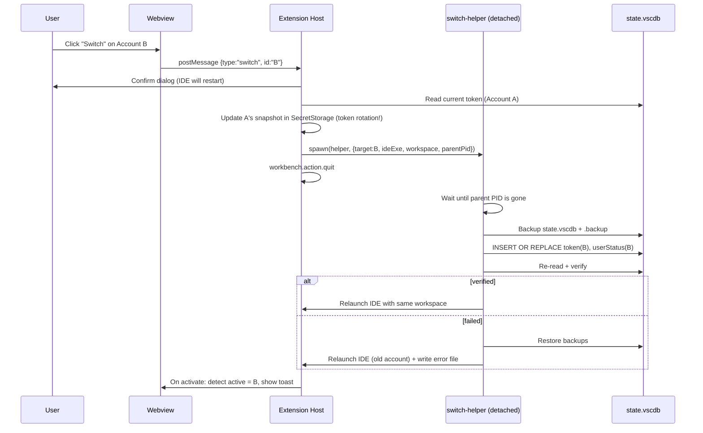

# Switchyard — Multi-Account Switcher for Google Antigravity

> **Working name:** `ag-switchyard`  
> A sidebar extension for the Antigravity IDE that shows every Google account you use, marks the active one, and lets you switch with one click — without repeating the browser Google sign-in every time.
>
> **Status:** Planning / pre-development · **Research date:** October 2026  
> **Type:** VS Code–compatible extension (TypeScript) · **Target IDE:** Google Antigravity (VS Code fork)

---

## Table of Contents

1. [What we are building](#1-what-we-are-building)
2. [Research findings (read this first)](#2-research-findings-read-this-first)
3. [Choosing the switching strategy](#3-choosing-the-switching-strategy)
4. [Architecture](#4-architecture)
5. [Tech stack](#5-tech-stack)
6. [Project structure](#6-project-structure)
7. [Implementation details](#7-implementation-details)
8. [UI / UX specification](#8-ui--ux-specification)
9. [Security and privacy](#9-security-and-privacy)
10. [Step-by-step roadmap](#10-step-by-step-roadmap)
11. [Testing strategy](#11-testing-strategy)
12. [Build, package, publish](#12-build-package-publish)
13. [Risks, limits and Terms of Service](#13-risks-limits-and-terms-of-service)
14. [Commands and settings](#14-commands-and-settings)
15. [References](#15-references)

---

## 1. What we are building

### Goals

| # | Goal | Notes |
|---|------|-------|
| 1 | Side panel in the Activity Bar | Same as any normal extension (Explorer, Git, etc.) |
| 2 | List all saved Google accounts | Email, display name/initial, plan badge if available |
| 3 | Clearly show the **active** account | Highlighted card + status bar item |
| 4 | One-click **Switch** | No browser OAuth during a switch |
| 5 | Add / rename / remove accounts | Add = capture once, then reuse forever |
| 6 | Safe by default | Backups, rollback, encrypted storage, no telemetry |

### The honest truth about "no browser login"

Each account must be signed in **once** in the browser (Google needs your consent for that account). After that, the extension reuses the saved session, so switching never opens the browser again. Anything claiming zero logins ever is not possible.

### Non-goals (deliberately excluded)

* Auto-rotating accounts to get around rate limits or quotas.
* Randomizing device IDs / "anti-correlation" tricks to hide that multiple accounts are used.
* Sending tokens to a server, team vault, or cloud sync.
* Using Antigravity tokens from any tool *other than* the official Antigravity IDE.

These are excluded because they push the extension toward terms-of-service violations (see [section 13](#13-risks-limits-and-terms-of-service)).

### UI wireframe (sidebar)

```
┌──────────────────────────────────┐
│  ACCOUNTS                 ⟳  ⚙   │
├──────────────────────────────────┤
│  ● ACTIVE                         │
│  ┌────────────────────────────┐  │
│  │ (R) rahul@gmail.com        │  │
│  │     Personal · AI Pro      │  │
│  │     Active since 10:42     │  │
│  └────────────────────────────┘  │
├──────────────────────────────────┤
│  OTHER ACCOUNTS (2)               │
│  ┌────────────────────────────┐  │
│  │ (W) work@company.com    ⋮  │  │
│  │     Work                   │  │
│  │                [ Switch ]  │  │
│  └────────────────────────────┘  │
│  ┌────────────────────────────┐  │
│  │ (C) client@gmail.com    ⋮  │  │
│  │     Client A               │  │
│  │                [ Switch ]  │  │
│  └────────────────────────────┘  │
├──────────────────────────────────┤
│  [ + Add account ]                │
└──────────────────────────────────┘
```

---

## 2. Research findings (read this first)

These findings drive every design decision below.

### 2.1 Antigravity is a VS Code fork

Antigravity is a VS Code fork, so standard VS Code extension APIs (WebviewViewProvider, SecretStorage, commands, status bar) work. Its extension marketplace is **Open VSX**, not the Microsoft Marketplace, so you must publish to Open VSX (and optionally ship a `.vsix` for manual install).

### 2.2 Where the login lives

| Surface | Where the Google login is stored |
|---------|----------------------------------|
| **Antigravity IDE** | SQLite file `state.vscdb`, table `ItemTable`, key `antigravityUnifiedStateSync.oauthToken`. The value is base64 protobuf wrapping another base64 protobuf — encoded, **not encrypted**. |
| Legacy IDE builds | Older key `jetskiStateSync.agentManagerInitState` |
| **Antigravity 2.0 desktop app** | OS keyring (Windows Credential Manager / macOS Keychain / Linux Secret Service) |
| **Antigravity CLI (`agy`)** | Token file `~/.gemini/antigravity-cli/antigravity-oauth-token` |

`state.vscdb` locations (folder name is `Antigravity` or `Antigravity IDE` depending on build — **detect both**):

| OS | Path |
|----|------|
| Windows | `%APPDATA%\Antigravity\User\globalStorage\state.vscdb` |
| macOS | `~/Library/Application Support/Antigravity/User/globalStorage/state.vscdb` |
| Linux | `~/.config/Antigravity/User/globalStorage/state.vscdb` |

Other keys seen in community tools: `antigravityUnifiedStateSync.userStatus` (plan/status), `storage.serviceMachineId`, and a `state.vscdb.backup` sibling file.

### 2.3 Existing community tools (competitors / prior art)

Several extensions already do this. Study them before writing code:

| Project | Approach |
|---------|----------|
| Multi-Account Cockpit (Open VSX) | One-click switch: closes Antigravity, injects token into the DB, restarts. Auto-backs up `state.vscdb`. |
| AG Multi-Account Switchboard (Open VSX) | Sidebar panel; tokens kept in VS Code SecretStorage. |
| `BoyGR/antigravity-account-switcher` | Detached worker writes `state.vscdb`; token vault with integrity checks. |
| `Davissss2/AntigravityAccounts` | Activity-bar panel, themes, auto-rotation (we will **not** copy rotation/anti-correlation). |
| `axosecurity/antigravity-auth-vault` | CLI that syncs CLI + IDE + 2.0 app state. |

**Why build another one?** Learning, a cleaner UI, tighter security (no team sync, no evasion features), and full control. If you only need the feature quickly, installing one of the above is faster — but vet its source first, because it handles refresh tokens.

### 2.4 Why a restart is needed

The IDE keeps auth in memory and rewrites `state.vscdb` on exit. Every working tool therefore: **(1)** saves the current account, **(2)** quits the IDE, **(3)** edits the DB while it is closed, **(4)** relaunches. An extension cannot hot-swap the token while the IDE runs. Plan the UX around a ~3–6 second restart that reopens your workspace.

### 2.5 Terms-of-service reality (important)

* Google's forum has many reports of Antigravity / Gemini Code Assist accounts disabled with a "violation of Terms of Service" 403 after people connected **third-party tools** (OpenClaw, OpenCode plugins) through Antigravity OAuth.
* A summary of the Antigravity Additional Terms says clause 6 names third-party software reaching the service via Antigravity OAuth as a breach. *(Secondary source — read the actual terms yourself.)*
* The community `antigravity-sdk` README states that extracting, storing, forwarding or reusing Antigravity OAuth tokens violates Google's terms and may lead to termination, and the SDK blocks token access by design.

**What this means for us:** the bans documented so far involve *other software making the API calls with your token*. Our design keeps the **official IDE** as the only thing that talks to Google. Still, copying tokens is a grey area nobody but Google can clarify. That is why this plan recommends a **safer default mode** (isolated profiles, section 3) and makes token swapping an opt-in experimental mode.

---

## 3. Choosing the switching strategy

| | **A. Isolated profiles** (recommended default) | **B. Token snapshot swap** (opt-in) | **C. Own OAuth client** (rejected) |
|---|---|---|---|
| How | Each account gets its own `--user-data-dir`; switching launches/focuses that profile's window | Save `oauthToken` per account; swap into `state.vscdb` while IDE is closed | Extension runs its own Google OAuth and talks to Antigravity APIs |
| Browser login | Once per account | Once per account | Once per account |
| Touches tokens? | **No** — extension never reads them | Yes (read + write) | Yes, plus API calls |
| Same window/workspace? | New window per account | Same window after restart | n/a |
| Settings/extensions shared? | Needs symlink/copy of settings and shared `--extensions-dir` | Yes, fully shared | n/a |
| Complexity | Low–medium | Medium–high (DB + protobuf + restart) | High |
| ToS risk | Lowest | Grey area | **High** — rejected |
| Best for | Personal ↔ work separation | "Same window, just change account" | — |

**Recommendation:** build **A first (v0.x)**, add **B behind a setting** (`switchyard.mode = "tokenSwap"`) with an explicit warning dialog. The UI is identical for both; only the `SwitchEngine` implementation differs, so the architecture below uses a strategy interface.

> ⚠️ **Phase 0 spike required.** Before building the UI, verify with your own installed build that (a) `--user-data-dir` truly isolates the login (the 2.0 desktop app uses the OS keyring, which a user-data-dir may not isolate), and (b) which keys change when you sign in and out. See [Phase 0](#phase-0--feasibility-spike-12-days).

---

## 4. Architecture

```
┌─────────────────────────── Antigravity IDE (Electron) ───────────────────────────┐
│                                                                                    │
│  Extension Host (Node)                          Webview (sandboxed iframe)         │
│  ┌──────────────────────────────────────┐       ┌──────────────────────────────┐   │
│  │ extension.ts (activate)              │       │ Svelte/React UI              │   │
│  │  ├─ AccountStore  (SecretStorage +   │ <───> │  - AccountList               │   │
│  │  │                 globalState)      │ post  │  - ActiveCard                │   │
│  │  ├─ AuthDetector  (who is active?)   │ Msg   │  - AddAccountDialog          │   │
│  │  ├─ SwitchEngine  (Strategy)         │       │  - SwitchOverlay             │   │
│  │  │    ├─ ProfileEngine  (mode A)     │       └──────────────────────────────┘   │
│  │  │    └─ TokenSwapEngine (mode B)    │                                          │
│  │  ├─ PanelProvider (WebviewViewProv.) │                                          │
│  │  └─ StatusBarController              │                                          │
│  └───────────────┬──────────────────────┘                                          │
│                  │ spawn detached (ELECTRON_RUN_AS_NODE=1)                         │
└──────────────────┼─────────────────────────────────────────────────────────────────┘
                   ▼
        ┌──────────────────────┐        writes while IDE is closed
        │ switch-helper.js     │ ─────────────────────────────────────►  state.vscdb (+ .backup)
        │ wait → backup →      │
        │ write → verify →     │ ─────────────────────────────────────►  relaunch IDE
        │ relaunch / rollback  │
        └──────────────────────┘
```

### Switch flow (mode B) — sequence



### Add-account flow

1. **Capture current login:** read the active token, store it as a new account (zero browser steps).
2. **Add a new account:** snapshot current → clear the token keys (or open a fresh profile in mode A) → user signs in once in the browser → on next activation the extension detects a new identity and offers "Save this account".

---

## 5. Tech stack

### Core

| Layer | Choice | Why | Alternatives |
|-------|--------|-----|--------------|
| Language | **TypeScript 5.x (strict)** | Type-safe VS Code API, best tooling | JavaScript (not advised) |
| Extension API | VS Code API (`vscode` module) | Antigravity is a VS Code fork | — |
| Runtime | Node (bundled in IDE's Electron) | No install for users | — |
| Bundler | **esbuild** | Very fast, officially suggested for extensions | webpack, tsup |
| Sidebar UI | **`WebviewViewProvider`** in an Activity Bar view container | Rich custom UI inside the sidebar | Native TreeView (simpler, less pretty) |
| Webview framework | **Svelte 5 + Vite** (small bundle) or **React 18 + Vite** | Component UI, fast reload | Lit, Preact, plain HTML |
| Styling | CSS using `--vscode-*` variables | Auto-matches every theme (dark/light/high-contrast) | Tailwind (needs care with CSP) |
| Icons | **`@vscode/codicons`** (+ inline SVG avatars) | Native look | Lucide |
| Local DB access | **`sql.js`** (SQLite compiled to WASM) | No native build, no Electron ABI mismatch | `better-sqlite3` (native; painful across Electron versions), `sqlite3` CLI, `node:sqlite` |
| Secrets | **`context.secrets`** (VS Code SecretStorage) | Uses OS keychain (Keychain / Credential Manager / libsecret) | `keytar` (deprecated) |
| Non-secret state | `context.globalState` | Account metadata, order, labels | JSON file |
| Process control | `child_process.spawn` + `ELECTRON_RUN_AS_NODE=1` | Run helper with IDE's own Node — end users need no Node install | Compile helper to a binary |
| Protobuf | Tiny hand-written varint/length-delimited reader (or `protobufjs`) | Only need to read email/plan; keep deps minimal | Full protobuf schema |
| Lint/format | ESLint + Prettier | Consistency | Biome |

### Tooling

| Need | Tool |
|------|------|
| Scaffold | `yo code` (Yeoman generator) or manual |
| Unit tests | **Vitest** |
| Integration tests | **`@vscode/test-electron`** |
| Webview tests | Vitest + Testing Library; Playwright optional |
| Package | **`@vscode/vsce`** → `.vsix` |
| Publish | **`ovsx`** → Open VSX |
| CI/CD | GitHub Actions |
| Versioning | Conventional commits + `changesets` / `release-please` |

> ℹ️ `@vscode/webview-ui-toolkit` was deprecated by Microsoft in 2025. Do not build on it; use plain CSS with `--vscode-*` variables and codicons.

### Compatibility rule

Check Antigravity's underlying VS Code version in **Help → About** and set `engines.vscode` in `package.json` to that version or lower, otherwise the IDE refuses to install the extension.

---

## 6. Project structure

```
ag-switchyard/
├─ package.json                 # manifest: views, commands, settings
├─ tsconfig.json
├─ esbuild.mjs                  # bundles extension + helper
├─ .vscodeignore
├─ README.md   CHANGELOG.md   LICENSE   SECURITY.md
├─ media/
│  ├─ icon.svg                  # activity bar icon (monochrome)
│  └─ icon.png                  # marketplace icon 128×128
├─ src/
│  ├─ extension.ts              # activate(), wiring
│  ├─ constants.ts              # keys, paths, view ids
│  ├─ platform/
│  │  ├─ paths.ts               # per-OS state.vscdb discovery (Antigravity / Antigravity IDE)
│  │  └─ ide.ts                 # find executable, args, workspace to relaunch
│  ├─ accounts/
│  │  ├─ AccountStore.ts        # CRUD; secrets in SecretStorage, meta in globalState
│  │  ├─ AuthDetector.ts        # read DB → identify active account
│  │  ├─ identity.ts            # JWT / protobuf → email, plan
│  │  └─ types.ts
│  ├─ db/
│  │  ├─ StateDb.ts             # sql.js wrapper: get/set/delete keys, export atomically
│  │  └─ backup.ts              # timestamped backups + retention
│  ├─ switch/
│  │  ├─ SwitchEngine.ts        # interface
│  │  ├─ ProfileEngine.ts       # mode A
│  │  ├─ TokenSwapEngine.ts     # mode B
│  │  └─ helper/switch-helper.ts# detached script (own bundle)
│  ├─ ui/
│  │  ├─ PanelProvider.ts       # WebviewViewProvider
│  │  ├─ messages.ts            # shared message types (host ⇄ webview)
│  │  └─ StatusBar.ts
│  └─ util/ logger.ts  mutex.ts  redact.ts
├─ webview/                     # separate Vite project
│  ├─ index.html
│  ├─ src/ App.svelte  components/…  stores/…  styles.css
│  └─ vite.config.ts
├─ test/
│  ├─ unit/  fixtures/          # fake state.vscdb files
│  └─ integration/
└─ .github/workflows/ ci.yml  release.yml
```

---

## 7. Implementation details

### 7.1 Manifest (`package.json` excerpt)

```jsonc
{
  "name": "ag-switchyard",
  "displayName": "Switchyard – Account Switcher for Antigravity",
  "publisher": "your-publisher-id",
  "version": "0.1.0",
  "engines": { "vscode": "^1.96.0" },          // ← match Antigravity's VS Code base
  "categories": ["Other"],
  "main": "./dist/extension.js",
  "activationEvents": ["onStartupFinished"],
  "contributes": {
    "viewsContainers": {
      "activitybar": [
        { "id": "agSwitchyard", "title": "Accounts", "icon": "media/icon.svg" }
      ]
    },
    "views": {
      "agSwitchyard": [
        { "type": "webview", "id": "agSwitchyard.panel", "name": "Accounts" }
      ]
    },
    "commands": [
      { "command": "switchyard.addAccount",    "title": "Switchyard: Add Account" },
      { "command": "switchyard.switchAccount", "title": "Switchyard: Switch Account…" },
      { "command": "switchyard.refresh",       "title": "Switchyard: Refresh" },
      { "command": "switchyard.restoreBackup", "title": "Switchyard: Restore Last Backup" }
    ],
    "configuration": {
      "title": "Switchyard",
      "properties": {
        "switchyard.mode": {
          "type": "string", "default": "profile",
          "enum": ["profile", "tokenSwap"],
          "description": "profile = isolated windows (safest). tokenSwap = restart IDE and swap saved session (experimental)."
        },
        "switchyard.confirmBeforeSwitch": { "type": "boolean", "default": true },
        "switchyard.backupRetention":     { "type": "number",  "default": 5 }
      }
    }
  }
}
```

### 7.2 Panel provider (skeleton)

```ts
export class PanelProvider implements vscode.WebviewViewProvider {
  static readonly viewType = 'agSwitchyard.panel';
  private view?: vscode.WebviewView;

  constructor(private ctx: vscode.ExtensionContext,
              private store: AccountStore,
              private engine: SwitchEngine) {}

  resolveWebviewView(view: vscode.WebviewView) {
    this.view = view;
    view.webview.options = {
      enableScripts: true,
      localResourceRoots: [vscode.Uri.joinPath(this.ctx.extensionUri, 'dist', 'webview')],
    };
    view.webview.html = this.html(view.webview);

    view.webview.onDidReceiveMessage(async (msg: ToHost) => {
      switch (msg.type) {
        case 'ready':   return this.push();
        case 'switch':  return this.engine.switchTo(msg.id);
        case 'add':     return vscode.commands.executeCommand('switchyard.addAccount');
        case 'rename':  await this.store.rename(msg.id, msg.label); return this.push();
        case 'remove':  await this.store.remove(msg.id);            return this.push();
      }
    });
  }

  async push() {
    this.view?.webview.postMessage({
      type: 'state',
      accounts: await this.store.list(),    // never includes tokens
      activeId: await this.store.activeId(),
    } satisfies ToWebview);
  }

  private html(webview: vscode.Webview) {
    const nonce = crypto.randomUUID().replace(/-/g, '');
    const base  = vscode.Uri.joinPath(this.ctx.extensionUri, 'dist', 'webview');
    const js  = webview.asWebviewUri(vscode.Uri.joinPath(base, 'main.js'));
    const css = webview.asWebviewUri(vscode.Uri.joinPath(base, 'main.css'));
    return /* html */`<!doctype html><html><head>
      <meta http-equiv="Content-Security-Policy"
        content="default-src 'none'; style-src ${webview.cspSource};
                 script-src 'nonce-${nonce}'; img-src ${webview.cspSource} data:;">
      <link rel="stylesheet" href="${css}">
    </head><body><div id="app"></div>
      <script nonce="${nonce}" src="${js}"></script></body></html>`;
  }
}
```

### 7.3 Message contract (`messages.ts`)

```ts
export type AccountMeta = {
  id: string;            // stable id (hash of email)
  email: string;
  label?: string;        // "Work", "Client A"
  plan?: string;         // optional, from userStatus
  addedAt: number;
  lastUsedAt?: number;
};

export type ToWebview =
  | { type: 'state'; accounts: AccountMeta[]; activeId?: string }
  | { type: 'busy';  message: string }
  | { type: 'error'; message: string };

export type ToHost =
  | { type: 'ready' }
  | { type: 'switch'; id: string }
  | { type: 'add' }
  | { type: 'rename'; id: string; label: string }
  | { type: 'remove'; id: string };
```

**Rule:** tokens never cross into the webview. The webview only ever sees `AccountMeta`.

### 7.4 Account storage

* **SecretStorage** key `switchyard.snapshot.<id>` → JSON blob of the session values for that account (encrypted by the OS keychain).
* **globalState** key `switchyard.accounts` → array of `AccountMeta` (no secrets).
* Use a **mutex** around every store/DB operation so concurrent actions cannot corrupt state.

### 7.5 Reading and writing `state.vscdb` (`StateDb.ts`)

```ts
import initSqlJs from 'sql.js';
import * as fs from 'node:fs';

export async function readKey(dbPath: string, key: string): Promise<string | undefined> {
  const SQL = await initSqlJs({ locateFile: f => require.resolve(`sql.js/dist/${f}`) });
  const db  = new SQL.Database(fs.readFileSync(dbPath));
  try {
    const st = db.prepare('SELECT value FROM ItemTable WHERE key = ?');
    st.bind([key]);
    return st.step() ? String(st.getAsObject().value) : undefined;
  } finally { db.close(); }
}

export async function writeKeys(dbPath: string, entries: Record<string, string>) {
  const SQL = await initSqlJs({ locateFile: f => require.resolve(`sql.js/dist/${f}`) });
  const db  = new SQL.Database(fs.readFileSync(dbPath));
  try {
    db.run('BEGIN');
    for (const [k, v] of Object.entries(entries)) {
      db.run('INSERT OR REPLACE INTO ItemTable (key, value) VALUES (?, ?)', [k, v]);
    }
    db.run('COMMIT');
    const tmp = dbPath + '.tmp';
    fs.writeFileSync(tmp, Buffer.from(db.export()));
    fs.renameSync(tmp, dbPath);                      // atomic replace
  } finally { db.close(); }
}
```

Rules:

* **Read-only reads** are safe while the IDE runs (read a copy to avoid lock contention). **Writes only when the IDE is fully closed**, otherwise it overwrites your change on exit.
* Handle `-wal` / `-shm` sidecar files: after the IDE has exited the WAL is normally checkpointed; if a `-wal` file still exists, copy all three files together for backup and prefer opening the DB through a SQLite build that understands WAL.
* Also update `state.vscdb.backup` so the IDE does not restore the old session from it.
* The `oauthToken` value is **double-base64 protobuf**: decode outer base64 → protobuf → inner base64 → protobuf. Treat the whole value as an opaque string when saving/restoring (round-trip it byte-for-byte); only decode when you need to *display* the email/plan.

### 7.6 Identifying the active account (`AuthDetector.ts`)

1. Read `antigravityUnifiedStateSync.oauthToken` (fallback to the legacy key).
2. Extract an identity, in order of preference: email from `userStatus` protobuf → email from the ID-token JWT payload (base64url-decode the middle segment) → fingerprint `sha256(refreshToken).slice(0,12)` (refresh tokens can rotate, so a fingerprint is a fallback only).
3. Match to `AccountStore` by email; mark as active.
4. Re-run on: extension activation, window focus, and a file watcher on `state.vscdb` (debounced ~500 ms).

> **Token rotation gotcha:** before every switch, re-capture the *current* account's latest token. If you restore an old snapshot of a refresh token that Google has since rotated, that account will silently fail to authenticate.

### 7.7 Switch engine

```ts
export interface SwitchEngine {
  readonly mode: 'profile' | 'tokenSwap';
  switchTo(accountId: string): Promise<void>;
}
```

**ProfileEngine (mode A)**

1. Account profile dir: `<globalStorage>/profiles/<id>` (or a user-chosen folder).
2. Launch: `antigravity --user-data-dir <profileDir> --extensions-dir <sharedExtDir> [workspace]` (detect the real executable via `process.execPath` / `vscode.env.appRoot`; verify the CLI flag names on your build).
3. First launch of a profile = user signs in once; later launches reuse it.
4. Optional "Sync settings" action copies `settings.json`, `keybindings.json`, `snippets/` into the profile.

**TokenSwapEngine (mode B)** — steps in order:

1. Show a confirm dialog explaining the restart and the experimental status.
2. Re-capture and save the current account's snapshot.
3. Spawn `switch-helper.js` **detached** with `ELECTRON_RUN_AS_NODE=1` using the IDE's own executable (so no external Node is required). Pass JSON: target snapshot (via a `0600` temp file, deleted after use), DB paths, IDE executable + args, workspace folders, parent PID.
4. Call `workbench.action.quit`.
5. Helper: poll `process.kill(parentPid, 0)` until the process is gone → backup DB files → `writeKeys` → re-read and verify the email/fingerprint matches → relaunch the IDE (`spawn(..., {detached:true, stdio:'ignore'}).unref()`).
6. On any failure: restore backups, relaunch, write an error file the extension shows on next start.
7. Delete the temp snapshot file; keep the last N backups (`backupRetention`).

### 7.8 Status bar

`$(account) rahul@gmail.com` on the left/right; click opens a Quick Pick of accounts (works even if the webview is closed). Tooltip shows label + last switch time.

### 7.9 Performance notes

* Activate on `onStartupFinished`, not `*`.
* Lazy-load `sql.js` WASM only when reading the DB.
* Don't poll; use `fs.watch` with debounce.
* Webview: `retainContextWhenHidden: false`; re-send state on `ready`.

---

## 8. UI / UX specification

### Layout

* **Header:** title, refresh (`$(refresh)`), settings (`$(gear)`).
* **Active card:** green dot, avatar (colored circle with initial), email, label chip, plan badge, "Active since …".
* **Account list:** card per account — avatar, email, label, last used, `Switch` primary button, overflow `⋮` (Rename, Set label color, Reveal profile folder, Remove).
* **Footer:** `+ Add account` button.

### States to design

| State | Behaviour |
|-------|-----------|
| Empty | Illustration + "Save your current login" primary button + short explanation |
| Loading | Skeleton cards (no spinners that jump) |
| Switching | Full-panel overlay: "Switching to work@… — IDE will restart", cancel disabled after helper starts |
| Error | Inline banner with plain-language message and "Restore backup" action |
| Detected new login | Toast/card: "Looks like a new account (x@y.com). Save it?" |
| Offline | Everything works (no network use) |

### Design rules

* Use only `--vscode-*` CSS variables (`--vscode-sideBar-background`, `--vscode-list-hoverBackground`, `--vscode-button-background`, `--vscode-focusBorder`, …).
* Active state must not rely on color alone: add a text badge **ACTIVE** and a `aria-current="true"`.
* Keyboard: Tab through cards, Enter = Switch, Del = Remove (with confirm), `F2` = Rename.
* Min touch/click target 28 px; truncate long emails with tooltip.
* Mask emails option: `switchyard.maskEmails` for screen-sharing (`r***@gmail.com`).
* Dark / light / high-contrast tested.

---

## 9. Security and privacy

| Threat | Mitigation |
|--------|------------|
| Tokens at rest | Only in **SecretStorage** (OS keychain). Never in plain files, settings, or `globalState`. |
| Temp files during switch | `0600` perms, random name, deleted in `finally`, wiped on next start if left over. |
| Token leaks to UI/logs | Webview gets metadata only; central `redact()` for logs; never log DB values. |
| Network exfiltration | Extension makes **no network requests**. State this in the README and verify in CI (grep for `fetch`, `http`, `net`). |
| Telemetry | None. |
| Malicious webview content | Strict CSP with nonce, `localResourceRoots`, no remote scripts/fonts. |
| DB corruption | Backup before write, atomic rename, post-write verification, restore command. |
| Supply chain | Few dependencies, `npm audit` + Dependabot, lockfile, provenance on release, pinned `sql.js`. |
| Export of tokens | **Do not implement** token export/import or team sync. |
| Antigravity stores tokens unencrypted | This is an upstream issue raised on Google's forum; our vault is *more* protected than the IDE's own copy, but the live token in `state.vscdb` remains readable by any local process. |

Ship a `SECURITY.md` with a vulnerability-reporting contact and a plain description of what data is touched.

---

## 10. Step-by-step roadmap

Estimated solo effort: **~4–5 weeks** part-time. Check items as you go.

### Phase 0 — Feasibility spike (1–2 days)

- [x] Install Antigravity; note **Help → About** (VS Code base version, build).
- [x] Locate `state.vscdb` (try both `Antigravity` and `Antigravity IDE` folders).
- [x] With the IDE closed, open a **copy** in DB Browser for SQLite; list `ItemTable` keys.
- [x] Sign in with account A → copy DB → sign out → sign in with account B → copy DB. **Diff the keys** to learn exactly what changes.
- [x] Test mode A: `antigravity --user-data-dir /tmp/agp1` — does it ask for login? Does a second profile keep a different login?
- [x] Confirm whether `workbench.action.quit` + relaunch from a detached process works on your OS.
- [x] Decide final default mode from the results. **Write findings in `docs/spike.md`.**

### Phase 1 — Scaffold + empty panel (2–3 days)

- [x] `npx --package yo --package generator-code -- yo code` → TypeScript extension (or hand-create).
- [x] Enable `strict`, ESLint, Prettier, esbuild bundling.
- [x] Add the Activity Bar container + `WebviewViewProvider` showing "Hello".
- [x] Press **F5** (Extension Development Host) — also test by installing the `.vsix` into real Antigravity (the dev host is VS Code, not Antigravity).
- [x] Set up Vite for `webview/` and the message contract.

### Phase 2 — UI with mock data (3–4 days)

- [ ] Build `ActiveCard`, `AccountCard`, `EmptyState`, `SwitchOverlay`, `Toast`.
- [ ] Feed from a mock store; test all states and themes.
- [ ] Add a11y (focus order, `aria-*`), email masking, keyboard shortcuts.
- [ ] Status bar item + Quick Pick fallback.

### Phase 3 — Account store + detection (4–5 days)

- [ ] `paths.ts` for Win/mac/Linux; unit tests with mocked `process.platform`.
- [ ] `StateDb.ts` with `sql.js`; test against fixture DBs.
- [ ] `identity.ts` (JWT/protobuf → email/plan) with tests.
- [ ] `AccountStore` (SecretStorage + globalState) with mutex.
- [ ] "Capture current login" command end-to-end → account appears in the panel as ACTIVE.
- [ ] File watcher + refresh.

### Phase 4 — Switching (7–10 days)

- [ ] Strategy interface; **ProfileEngine** first (launch isolated profile window).
- [ ] Settings sync helper for profiles.
- [ ] **TokenSwapEngine:** helper script bundle, detached spawn, wait-for-exit, backup, write, verify, relaunch.
- [ ] Rollback + "Restore last backup" command.
- [ ] "Add new account" guided flow (detach → sign in → detect → save).
- [ ] Re-capture-before-switch (rotation safety).
- [ ] Manual test matrix on Windows, macOS, Linux.

### Phase 5 — Hardening (3–4 days)

- [ ] Remove/redact all token logging; audit for network calls.
- [ ] Edge cases: DB locked, missing DB, corrupted DB, IDE update changes key names (graceful "unsupported version" message).
- [ ] Multiple IDE windows open (warn, or quit all).
- [ ] Unit + integration tests, coverage on `db/` and `switch/`.

### Phase 6 — Package and publish (2–3 days)

- [ ] Icon, screenshots/GIF, `CHANGELOG`, `LICENSE` (MIT), `SECURITY.md`.
- [ ] `vsce package` → test `.vsix` via **Extensions → … → Install from VSIX**.
- [ ] Publish to **Open VSX** (`ovsx publish`).
- [ ] GitHub Actions: lint → test → package → publish on tag.

### Phase 7 — Optional later

- [ ] Account labels/colors, drag-to-reorder, pin favorites.
- [ ] Per-workspace default account hint (just a reminder, no auto-switch).
- [ ] Antigravity CLI (`agy`) file support (opt-in).
- [ ] Localization (`vscode-nls` / `l10n`).

---

## 11. Testing strategy

| Level | What | Tool |
|-------|------|------|
| Unit | `paths`, `identity`, `StateDb`, `AccountStore`, redaction | Vitest + fixture `.vscdb` files made with sql.js |
| Integration | Activate extension, run commands, panel messaging | `@vscode/test-electron` |
| Helper | Run `switch-helper` against a temp DB with a fake parent PID | Vitest (child process) |
| Manual matrix | Win 10/11, macOS (Intel/ARM), Ubuntu; fresh install + upgraded install | Checklist in `docs/manual-tests.md` |
| Failure injection | Kill helper mid-write, read-only DB, missing backup, IDE won't relaunch | Scripted |
| Security | `npm audit`, grep for network APIs, secret scanning (gitleaks) in CI | CI |

**Golden rule for fixtures:** never commit a real `state.vscdb`. Generate synthetic DBs with fake tokens in test setup.

---

## 12. Build, package, publish

```bash
# prerequisites: Node 20+ and npm
npm install
npm run build            # esbuild (extension + helper) + vite (webview)
npm run watch            # dev

# package
npx @vscode/vsce package            # → ag-switchyard-0.1.0.vsix

# install manually into Antigravity
#   Extensions view → ⋯ → Install from VSIX…  (or the antigravity CLI's --install-extension)

# publish to Open VSX (Antigravity's default registry)
npx ovsx create-namespace your-publisher-id -p $OVSX_PAT   # first time
npx ovsx publish ag-switchyard-0.1.0.vsix -p $OVSX_PAT
```

Notes:

* Get an Open VSX access token at open-vsx.org (login with GitHub, sign the publisher agreement).
* `code --install-extension` installs into VS Code, **not** Antigravity — use the IDE's own UI/CLI.
* Keep `.vscodeignore` tight (exclude `src/`, `webview/src/`, tests) so the package stays small.
* Some users switch Antigravity to the Microsoft Marketplace via settings; optionally also publish there later.

---

## 13. Risks, limits and Terms of Service

| Risk | Likelihood | Impact | Mitigation |
|------|-----------|--------|------------|
| Antigravity update changes storage keys/format | High | Breaks switching | Version detection, "unsupported" fallback, quick patch releases, backups |
| Antigravity 2.0 / CLI use keyring or different files | Medium | Wrong surface switched | Scope v1 to the IDE; document clearly |
| Refresh-token rotation invalidates snapshots | Medium | Account needs re-login | Re-capture before each switch; "re-login" action |
| Google treats token copying as a violation | **Unknown / non-zero** | Account suspension | Default to profile mode; token swap opt-in + warning; no automation, rotation, or evasion; official IDE only |
| Data loss on write failure | Low | Lost login | Backups + atomic write + rollback |
| `--user-data-dir` doesn't isolate login on some builds | Medium | Mode A fails | Phase 0 spike; fall back to mode B |

**Disclaimer to include in the published README:** *This project is unofficial and not affiliated with or endorsed by Google. You are responsible for complying with the Antigravity and Google terms of service for every account you use. Do not use this tool to evade quotas or usage limits, and use only accounts you own or are authorized to use.*

---

## 14. Commands and settings

| Command ID | Title | Description |
|-----------|-------|-------------|
| `switchyard.addAccount` | Add Account | Capture current login or start guided new-account flow |
| `switchyard.switchAccount` | Switch Account… | Quick Pick of saved accounts |
| `switchyard.refresh` | Refresh | Re-read active account |
| `switchyard.restoreBackup` | Restore Last Backup | Roll back `state.vscdb` |

| Setting | Default | Meaning |
|---------|---------|---------|
| `switchyard.mode` | `profile` | `profile` or `tokenSwap` |
| `switchyard.confirmBeforeSwitch` | `true` | Ask before restarting |
| `switchyard.backupRetention` | `5` | Number of DB backups to keep |
| `switchyard.maskEmails` | `false` | Hide emails in the UI |

---

## 15. References

Research sources (October 2026):

* How Antigravity uses Open VSX and manual `.vsix` install — https://medium.com/@agurindapalli/how-to-install-vs-code-marketplace-extensions-in-googles-antigravity-ide-example-deepblue-theme-689cdcd735eb
* Switching Antigravity to the VS Code Marketplace — https://jimmysong.io/blog/antigravity-vscode-style-ide/
* Multi-Account Cockpit (Open VSX) — https://open-vsx.org/extension/Wanow/antigravity-cockpit-multi-account
* AG Multi-Account Switchboard (Open VSX) — https://open-vsx.org/extension/erennyuksell/ag-multi-account-switchboard
* `BoyGR/antigravity-account-switcher` — https://github.com/BoyGR/antigravity-account-switcher
* `Davissss2/AntigravityAccounts` — https://github.com/Davissss2/AntigravityAccounts
* `axosecurity/antigravity-auth-vault` — https://github.com/axosecurity/antigravity-auth-vault
* Token storage in `state.vscdb` (Google AI Developers Forum) — https://discuss.ai.google.dev/t/ide-google-oauth-refresh-token-is-stored-unencrypted-in-state-vscdb-antigravityunifiedstatesync-oauthtoken/186209
* Key-format history (`jetskiStateSync…` → `antigravityUnifiedStateSync…`) — https://github.com/jlcodes99/vscode-antigravity-cockpit/blob/main/CHANGELOG.md
* Antigravity SDK (token-access policy note) — https://github.com/Kanezal/antigravity-sdk
* Account suspensions tied to third-party OAuth tools — https://discuss.ai.google.dev/t/antigravity-gemini-code-assist-disabled-403-tos-violation-appeal-assistance-needed/124025
* Summary of Antigravity Additional Terms, clause 6 (secondary source) — https://moclaw.ai/blog/antigravity-account-suspended-third-party
* VS Code extension docs — https://code.visualstudio.com/api (Webview API, SecretStorage, WebviewViewProvider, Publishing)
* Open VSX publishing — https://github.com/eclipse/openvsx/wiki/Publishing-Extensions

---

**License:** MIT (recommended) · **Contributions:** welcome after v0.1 · **Unofficial** — not affiliated with Google.
